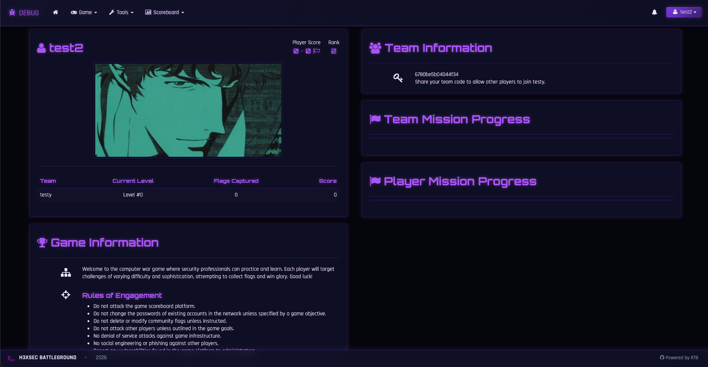

# 🛡️ H3XSEC Battleground

**H3XSEC Battleground** is a real-time competition platform powering H3XSEC's capture the flag (CTF) events and training exercises. Built for offensive and defensive security practitioners, the platform delivers an immersive wargaming experience that bridges the gap between gamified learning and real-world security operations.

Whether you're running a public CTF competition, internal red/blue team exercise, or a structured training program, H3XSEC Battleground provides the scoring infrastructure to keep players engaged and the action moving.

## 🎮 Live Competition

Ready to test your skills? Join an active H3XSEC competition at **[battleground.h3xsec.com](https://h3xsec.com)** and compete against security professionals from around the world.

## ⚡ Platform Capabilities

- **Flexible Competition Formats** — Team-based warfare or solo hunting
- **Live Scoreboard & Analytics** — Real-time WebSocket updates with animated rankings and performance graphs
- **Diverse Flag System** — Static, regex, datetime, multiple choice, and file submission flags with granular validation rules
- **Dynamic Scoring Engine** — Adjustable penalties, hints, attempt limits, level bonuses, and category weighting
- **Built-in Collaboration** — Team file sharing and admin-controlled material distribution
- **Integrated Tools** — CyberChef access for on-the-fly encoding/decoding and analysis
- **CTFTime Integration** — Standards-compliant JSON scoreboard feed for official events
- **Story Mode** — Optional narrative-driven experience with intro sequences and milestone-triggered content
- **Advanced Game Mechanics** — Botnet simulations, player "SWAT" mechanics, in-game economy, and cracked password walls of shame
- **Global Language Support** — Localized interface for international competitions
- **Flexible Deployment** — Cloud-ready, Docker containerized, or bare metal installation

## 🚀 Quick Start

Check out the **[H3XSEC Battleground Documentation](https://github.com/yourusername/H3XSEC-Battleground/wiki)** for installation guides, configuration options, and competition setup tutorials.

### System Requirements
- Python 3.13+ or PyPy
- Ubuntu 22.04+ / Debian 12+ (recommended) — also runs on BSD, macOS, and Windows
- Docker support available for containerized deployments

## ❓ Support & Community

Questions about running your own H3XSEC Battleground instance? Want to request a feature for an upcoming competition? **[Open an issue](https://github.com/yourusername/H3XSEC-Battleground/issues)** and we'll help you out.

## 📜 Attribution & License

H3XSEC Battleground is built upon and extends the Root the Box CTF scoring engine, originally created by [moloch--](https://github.com/moloch--/RootTheBox) and contributors.
